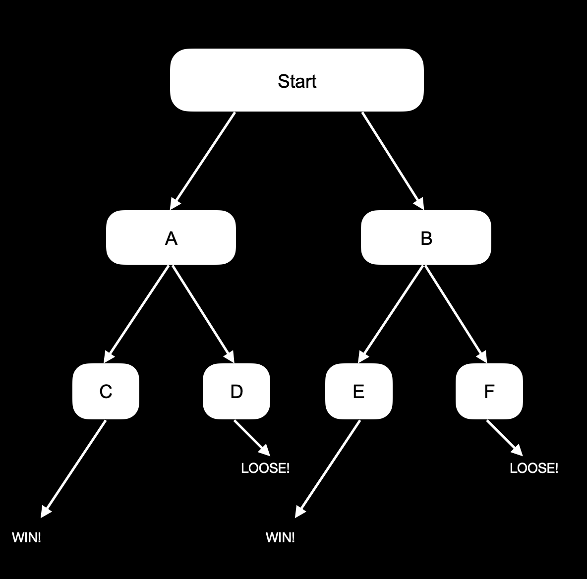
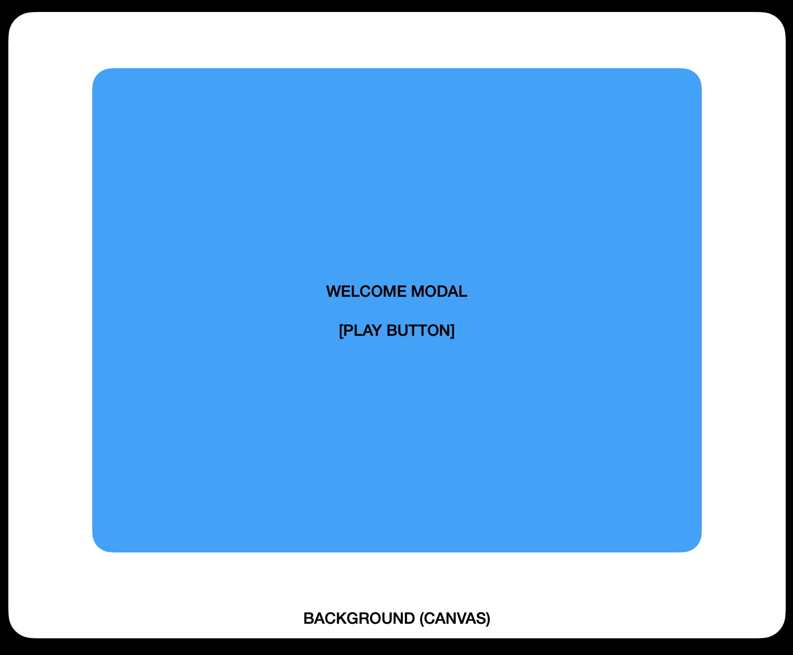
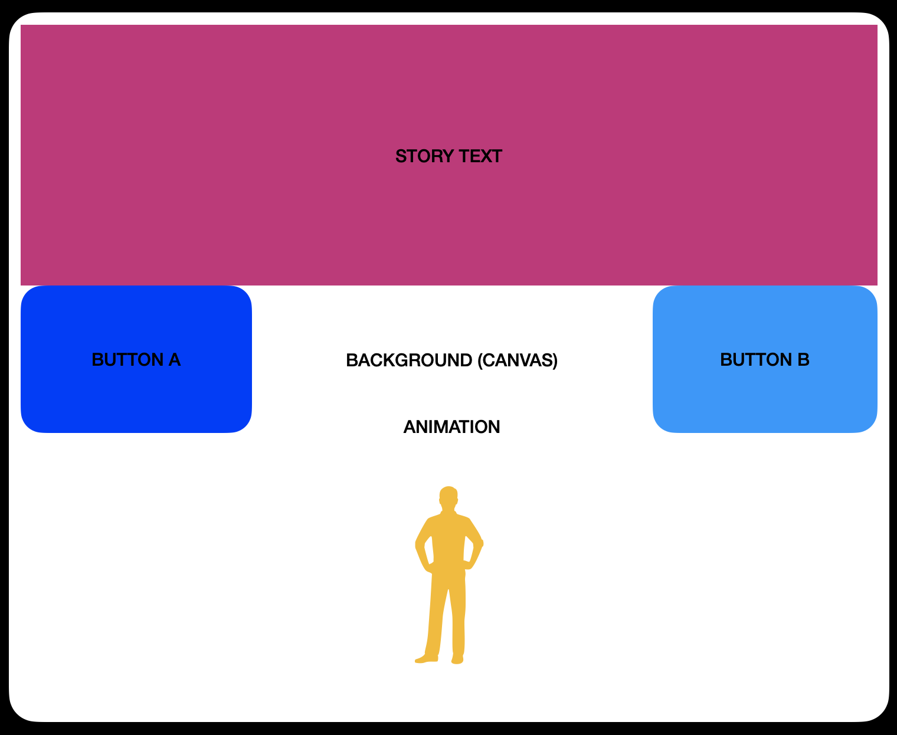
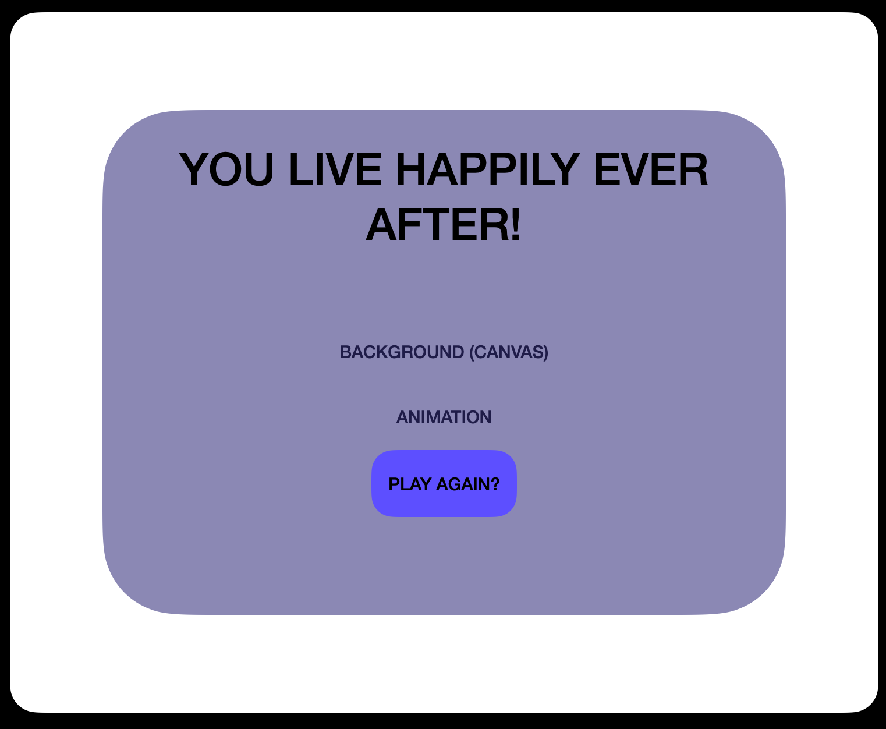
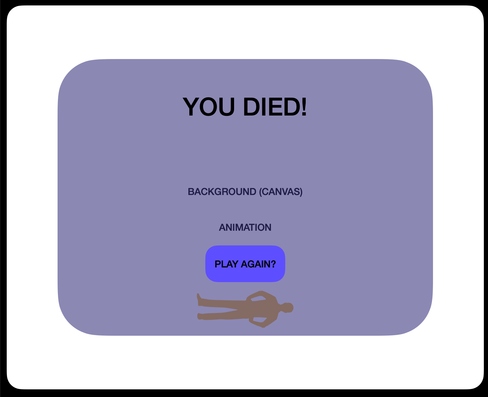

### Concept:

My project 4 will be a choose your own adventure game. It will use
React, JS, CSS & JS to animate. It will be fully front end and store any data needed in
state.

### MVP:

The game will start and you will get to choose life choices for your character.
It will offer two choices per screen. After 3 choices you either win or loose.

There will be pages to prompt the beginning and ending of the game with start and restart buttons. Each game-play screen will have it's own animation using canvas.

### Stretch:

More detailed animation, more choices (more JS logic) and mernAuth.

### User Story:

1. The user brings up the home/main page and they see a
   prompt asking them to play.

2. The user clicks play (it's their only option).

3. The user now sees the page disappear- and behind it is a landscape with an animated
   character. Above the character there is text telling a story.

4. The user now reads the text and chooses between 2 options below (2 buttons).

5. The user's choice now brings them down a path, creating their own story line. Each story line eventually ends. You can win or loose. Each bend in the path (each button) brings the user to a
   new page, or new animation.

   A. If the user makes about 3 button clicks and it leads to death- a page will
   appear saying they died (sad).

   B. If the user chooses around 3 button clicks and it leads to a "happily ever
   after" a page will pop up congratulating them on their win!

6. If the user gets either outcome, the page will still contain a "play again?" button, that
   resets the game and they start fresh.

### Wire Frames:

